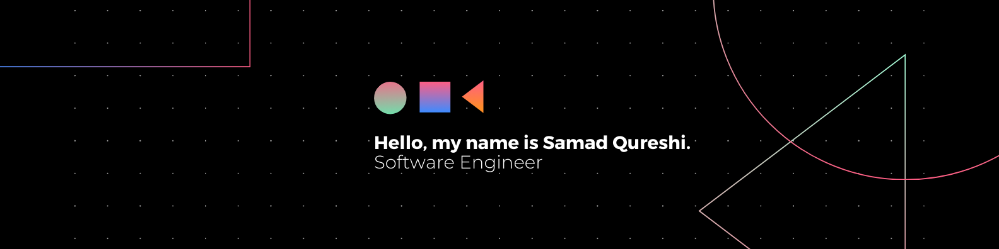

# React Native Mobile Application Developer

Welcome to my GitHub profile! 👋 I'm Samad Qureshi, a passionate software engineer specializing in building mobile applications using React Native and JavaScript. With 2+ years of experience in the field, I thrive on crafting innovative and user-friendly solutions for both Android and iOS platforms.

## About Me

I have a deep understanding of the React Native framework and its ecosystem, leveraging its capabilities to deliver high-performance, cross-platform mobile apps. My expertise includes:

- **React Native Development**: Proficient in developing mobile applications from scratch using React Native, ensuring smooth and seamless user experiences across devices.
- **JavaScript Mastery**: Strong command over JavaScript, including ES6+ features, asynchronous programming, and functional programming concepts.
- **UI/UX Design**: Skilled in creating intuitive and visually appealing user interfaces with React Native's component-based architecture, coupled with responsive design principles.
- **RESTful APIs Integration**: Experienced in integrating RESTful APIs for data retrieval, authentication, and communication with backend services.
- **State Management**: Familiarity with state management libraries like Redux and Context API to efficiently manage application state and data flow.
- **Testing and Debugging**: Proficient in writing unit tests using Jest and debugging applications to identify and resolve issues effectively.
- **Deployment and Publishing**: Experienced in deploying React Native apps to app stores (Google Play Store and Apple App Store) and managing the release process.

## What You'll Find Here

In this GitHub repository, you'll find a collection of my projects, ranging from simple demos to full-fledged mobile applications. Each project demonstrates my skills in React Native development and showcases best practices in software engineering.

Feel free to explore the code, raise issues, or reach out to me for collaboration opportunities. I'm always excited to connect with fellow developers and contribute to meaningful projects together!

---

Feel free to customize it according to your specific experience, projects, and preferences. Happy coding! 🚀
